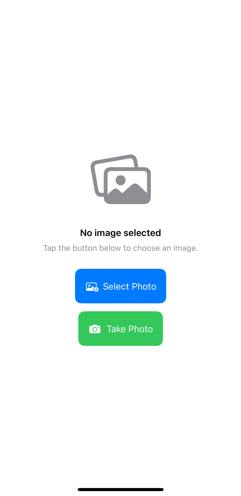
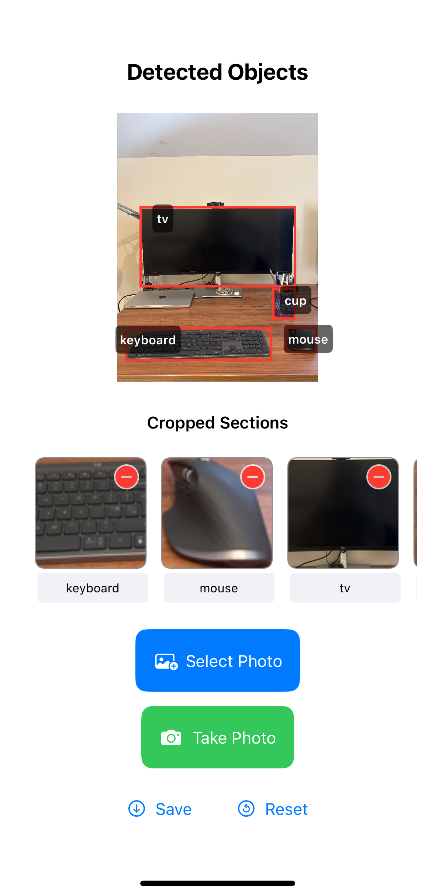

# ObjectSense - iOS App for Creating Home Inventory with Object Detection

ObjectSense is an iOS application that demonstrates real-time object detection using the YOLO model with Core ML. Users can select images from their photo library or take new photos with the camera. The app then identifies objects within the image, draws bounding boxes around them, and allows users to view and edit the predicted labels. This removes the hassle of manually taking inventory photos and helps in creating a home inventory system efficiently.

<!-- <p align="center">
	
	
</p> -->

<p align="center">
    <div alt="input_1" style="width:350px;">
        <h3 style="margin-bottom: 10px;">Main View</h3>
	    
    </div>
    <div alt="input_1" style="width:350px;">
        <h3 style="margin-bottom: 10px;"> Labels</h3>
	    
    </div>
</p>

## Features

*   **Image Selection**: Choose images from the device's photo library.
*   **Camera Capture**: Take new photos directly within the app.
*   **Object Detection**: Utilizes a YOLO Core ML model to detect objects in the selected image.
*   **Cropped Sections**: Shows individual cropped images of each detected object.
*   **Editable Labels**: Allows users to view and edit the predicted label for each detected object.
*   **Save Cropped Images**: Save the identified cropped sections to the photo library.

## Screenshots

<div align="center">
    
</div>

<!-- Add your screenshots here. You can link them from an 'images' folder in your repository. -->

**Main View (No Image Selected):**
<!--  -->

**Image with Detections:**
<!--  -->

**Cropped Sections with Editable Labels:**


## Demo Video

<!-- Link to your project demonstration video. You can upload it to YouTube, Vimeo, or include it in your repository. -->

[Watch the Demo Video](link_to_your_demo_video.mp4) <!-- Replace with actual link or file path -->

## Technologies Used

*   **SwiftUI**: For the user interface and application structure.
*   **Core ML**: For integrating and running the machine learning model on-device.
*   **Vision Framework**: For automatic preprocessing images and handling Core ML transformation.
*   **PhotosUI**: For picking images from the photo library.
*   **AVFoundation**: For accessing the camera.

## Setup and Running the Project

1.  **Clone the Repository:**
    ```bash
    git clone https://github.com/adl1995/ObjectSense.git # Replace with your repo URL
    cd ObjectSense
    ```
2.  **Open in Xcode:** Open the `ObjectSense.xcodeproj` file in Xcode.
3.  **YOLO Core ML Model**: This project expects a `Yolo.mlpackage` or `Yolo.mlmodel` Core ML model file. 
    *   If your model is named differently or not included, ensure you add your `.mlmodel` file to the project.
    *   Update the `ModelHandler.swift` (or equivalent model loading code) if your model's class name is different from the one currently used.
4.  **Build and Run:** Select a target device or simulator and run the app (Cmd+R).

## Future Enhancements / To-Do

*   [ ] Real-time object detection from the live camera feed.
*   [ ] Improve UI/UX animations and transitions.
*   [ ] Add settings for detection confidence thresholds.

## License

This project is licensed under the MIT License - see the [LICENSE.md](LICENSE.md) file for details (you'll need to create this file if you choose to include one).
